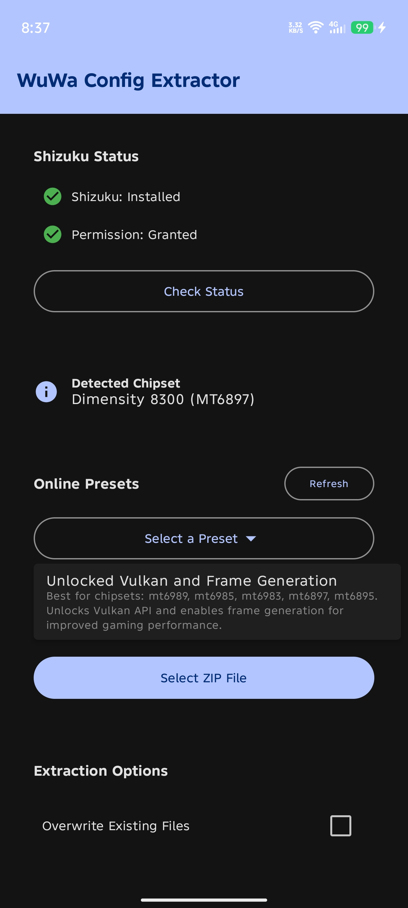
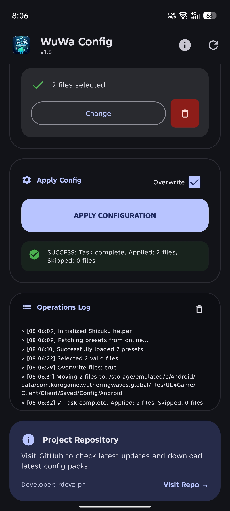

# WuWa Config Extractor

An Android application designed to safely and easily extract configuration files for Wuthering Waves into the restricted Android/data directory using Shizuku.

## Screenshots

| Main Screen | Extraction Progress |
|:-----------:|:-------------------:|
|  |  |

## Video Tutorial

## Features

- **Direct Extraction**: Extract ZIP **or select multiple `.ini` configuration files** to move directly to `com.kurogame.wutheringwaves.global/files/UE4Game/Client/Client/Saved/Config/Android`.
- **Multi‑Select INI Files**: **Pick one or more `.ini` files at once from your storage for batch transfer.**
- **Shizuku Integration**: Leverages Shizuku for root-less access to restricted system directories.
- **Online Presets**: Download and apply pre-configured optimizations directly from the official repository (https://github.com/rdevz-ph/wuwa-configs).
- **Chipset Compatibility Check**: Automatically verifies if a configuration ZIP (containing `chipset.txt`) is compatible with your device's hardware before extraction.
- **Detailed Logging**: Real-time feedback and logs for the extraction process.
- **Overwrite Protection**: Option to overwrite existing files or skip them.

## Requirements

1. **Shizuku App**: You must have the Shizuku app installed and running on your device.
2. **Permission**: Grant Shizuku permission to this app when prompted.
3. **Android 8.0+**: Minimum supported version is Android 8.0 (API 26).

## How to Use

1. **Start Shizuku**: Ensure the Shizuku service is running via Wireless Debugging or ADB.
2. **Select Config**:
   - Choose a preset from the Online Presets dropdown.
   - Tap **Select ZIP File** to pick a custom configuration from your storage.
   - **Tap Select INI Files to pick one or more `.ini` files directly (multi‑select supported).**
3. **Check Compatibility**: The app will automatically detect your chipset and check it against the ZIP's requirements **(only applicable when using a ZIP file)**.
4. **Extract**: Tap **Extract Files**. The app will handle the rest.

## Frequently Asked Questions

### Why was this tool created?
Many players still rely on the traditional method of manually extracting configuration files and navigating through restricted system folders. This tool simplifies that process, eliminating the need for complex file manager setups or root access—making configuration changes safer and more accessible.

### Is this app safe to use?
Yes, the app itself is safe to use. However, while it is a third-party utility similar to Shizuku or ZArchiver, it functions strictly as a helper tool for extracting configuration files for Wuthering Waves. It belongs to the same category as companion apps like WuWa pity counters:

> [!NOTE]
> All operations are performed locally on your device. This tool does not interact with or modify the game's server-side processes, and it is **not a hacking or cheating tool**. Because it operates outside the official app ecosystem, some security software may flag it simply as an unknown third-party application. Use at your own discretion.

## Creating a Compatible ZIP

To support the compatibility check, add a `chipset.txt` file to the root of your ZIP with supported model codes (e.g., `mt6877` for Dimensity 900). 

## Disclaimer
> [!WARNING]
> **WuWa Config Extractor** is an independent tool created for educational and personal use only.  
> It is **not affiliated with, endorsed by, or connected to Kuro Games** in any way.
>
> - All trademarks, game assets, and intellectual property belong to their respective owners.
> - This tool modifies configuration files of *Wuthering Waves*. **Use at your own risk.**
> - The developers assume no liability for any account bans, data loss, or device issues resulting from the use of this software.
> - Always back up your original configuration files before making changes.
>
> By using this application, you acknowledge that you are solely responsible for any consequences.

## License

This project is licensed under the [MIT License](LICENSE).
